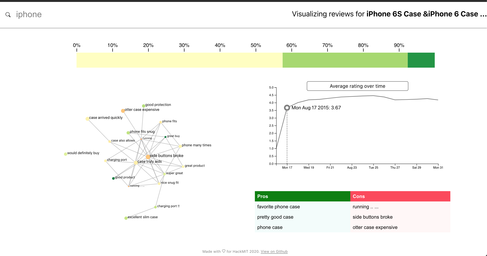

# review-visualizer



Made for HackMIT 2020. A tool that presents visualizations of aggregate
review data for individual Amazon products to provide quick at-a-glance insights with more relevant detail than simple star averages.

## Features
* Uses sentiment analysis to give more detail on review comment contents
* Extracts keywords to summarize most frequently mentioned pros/cons across reviews
* Generates a time series for a moving average of star reviews over time, to account
for stale information and changing needs of users over time
* Uses web scraping to provide live review data to the web app

## Setup

Download amazon dataset (https://s3.amazonaws.com/amazon-reviews-pds/readme.html) into root directory and place in a data folder.

### Server setup

```
cd src/server
python main.py
```


### Frontend setup

```
cd src/frontend/rv-frontend
npm start
```
